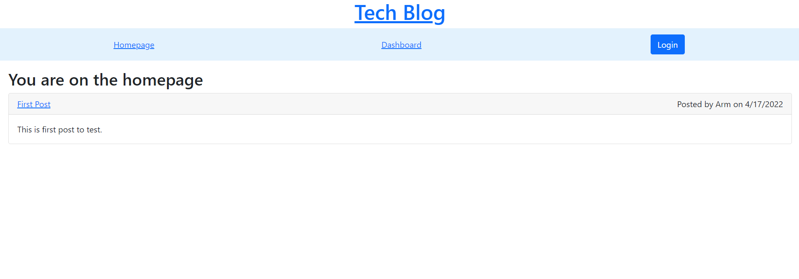

# tech-blog

## Description
The purpose of this application is to have an application that would allow you to keep track of tech news and articles through a blog.

## Table of Contents

* [Installation](#installation)
* [Usage](#usage)
* [Credits](#credits)
* [License](#license)

## Installation

The project is viewable at the project's heroku page.

URL of deployed application: https://ancient-bastion-37816.herokuapp.com/

## Usage
The blog allows you to see posts even when not logged in. In order to reply, create, edit, and delete posts the user would have to sign up or log in. Once logged in all the options would become available to that user.

## Credits

[Armando Cuellar](https://github.com/armcuellar) 

## License

Licencsed under [MIT License](LICENSE)

